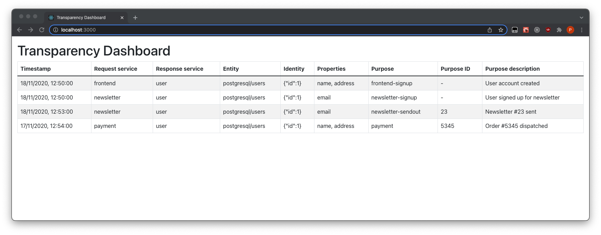

# Transparency Log

> ### Live demo:
> https://hawk-transparency-dashboard.netlify.app/

## First idea

Our first idea was to create a _Dashboard_, where the user can see all the outputs from our transparency library. \
We defined a `trace` data structure for saving transparency records:

```json
{
  "requestService": "service-1",
  "responseService": "service-2",
  "timestamp": "2020-11-18T11:50Z",
  "data": {
    "entity": "database/tablename",
    "identity": { "id": 1 },
    "properties": ["prop-x", "prop-y"]
  },
  "purpose": {
    "type": "purpose-type-x",
    "formatted": "Action x dispatched"
  }
}
```

The following table gives the general impression how the transparency data can be displayed:

| Request Service | Response Service | Data           | Purpose             | Timestamp        |
| --------------- | ---------------- | -------------- | ------------------- | ---------------- |
| service-1       | service-2        | prop-x, prop-y | Action x dispatched | 18.11.2021 11:53 |
| service-1       | service-2        | prop-x, prop-y | Action x dispatched | 18.11.2021 11:52 |

The `query` data structure gives an impression how the data could be queried:

```json
{
  "service": "service-name",
  "entity": "database/tablename",
  "identity": { "key": "value" }
}
```

### Implementation

The [frontend](frontend) directory contains a React frontend that renders [dummy transparency data](frontend/src/dummyData.ts) in the `trace` format. Go to the folder to find out more about runnning the webapp locally or building the static website.


## Second try

We realized some limitations of the first approach and also very informative, but less entertaining style of the dashboard.

Instead of defining new data structures again, we tried to better understand the use case for our dashboard.
We moved our focus from the _user of the product_ to the _data controller_ and providing better overview of the system.
We also considered different data aggregation and filtering scenarios through.

### Two views

Instead of showing one big table with all requests, we've come to the conclusion that the dashboard should provide two views: `overview` and `requests`. In the `overview`, the user should be able to:

- compare the amount of traffic between different services,
- get general insights on the purpose of all the traffic happening in the system.

This could be implemented in a way similar to the [Service Dependency Graph](https://github.com/NovatecConsulting/novatec-service-dependency-graph-panel):


In the `requests`, the user should be able to:

- get details of any single request exchanged between any two services,
- get detailed insigths on a limited number of some requests that share similar characteristics.

In other words, the `requests` will more or less be the table from our first approach, with the restricton that the number of requests displayed will be limited.

### `/overview`

All requests grouped by Service pairs:

| Requestor  | Provider | Count | Last invocation time | See requests |
| ---------- | -------- | ----- | -------------------- | ------------ |
| newsletter | user     | 23423 | 2021-12-06 16:00:12  | Link         |
| frontend   | user     | 7468  | 2021-12-06 16:00:12  | Link         |

> Requestor/Provider are more more specific names than "From/To or "Source/Destination",\
> in our opinion, the latter do not indicate enough who is sending the request and who is sending the data

All requests grouped by Purpose

| Purpose           | Count | Last invocation time | See requests |
| ----------------- | ----- | -------------------- | ------------ |
| payment           | 234   | 2021-12-06 16:00:12  | Link         |
| newsletter-signup | 99    | 2021-11-23 17:04:50  | Link         |
| frontend-signup   | 100   | 2021-11-23 17:04:49  | Link         |

All Requests grouped by Endpoint

| Provider | Endpoint    | Count | Last invocation time | See requests |
| -------- | ----------- | ----- | -------------------- | ------------ |
| user     | /newsletter | 3643  | 2021-12-06 15:58:03  | Link         |
| user     | /newsletter | 2342  | 2021-12-06 15:57:02  | Link         |

### `/requests`

See requests, for example:

- of specific Purpose: `/requests?purpose=payment`
- with Endpoint filtering: `/requests?endpoint=newsletter`
- using specific Method: `/requests?method=http-get`
- with all of the above: `/requests?purpose=payment&endpoint=newsletter&method=http-get`
- etc.

| Invocation time     | Request ID | Requestor  | Provider | Endpoint    | Method   | More columns... |
| ------------------- | ---------- | ---------- | -------- | ----------- | -------- | --------------- |
| 2021-12-06 15:58:03 | 32517631   | newsletter | user     | /newsletter | http-get | more...         |
| 2021-12-06 15:57:02 | 32517630   | newsletter | user     | /newsletter | http-get | more...         |

#### `/requests/requestId`

```json
Requestor:    newsletter
Provider:     user
Endpoint:     /newsletter
Method:       http-get
Date:         2021-12-06 15:59:11
Purpose Type: order
Purpose Data: {
                "id": 232342,
                "paymentMethod": "paypal",
                "transactionId": "23423423454",
                ...
              }
```

| Category          | Field          | Privacy Level | Count | Unique Count |
| ----------------- | -------------- | ------------- | ----- | ------------ |
| User-Related-Data | User E-Mail    | 2             | 133   | 23           |
| User-Related-Data | User Last-Name | 2             | 133   | 23           |

# Fields & Mappings

## Privacy levels

Privacy levels can be used to filter the requests or endpoints that exchange any particular kind of data.

- **personal data** - means any information relating to an identified or identifiable natural person (‘data subject’); an identifiable natural person is one who can be identified, directly or indirectly, in particular by reference to an identifier such as a name, an identification number, location data, an online identifier or to one or more factors specific to the physical, physiological, genetic, mental, economic, cultural or social identity of that natural person

- **genetic data** - means personal data relating to the inherited or acquired genetic characteristics of a natural person which give unique information about the physiology or the health of that natural person and which result, in particular, from an analysis of a biological sample from the natural person in question

- **biometric data** - means personal data resulting from specific technical processing relating to the physical, physiological or behavioural characteristics of a natural person, which allow or confirm the unique identification of that natural person, such as facial images or dactyloscopic data

- **data concerning health** - means personal data related to the physical or mental health of a natural person, including the provision of health care services, which reveal information about his or her health status

- **(non-personal data)** - default category, not handled explicitly by this project

The definitions are taken from the Art. 4 GDPR.

## Fields

| Name              | Privacy Level                                       |
| ----------------- | --------------------------------------------------- |
| user              | personal data                                       |
| blood-test-result | personal data, genetic data, data concerning health |

## Mappings

### Existing mappings

| Service name | Endpoint    | HTTP status code | Mapping       |
| ------------ | ----------- | ---------------- | ------------- |
| user         | /newsletter | 200              | See/configure |
| newsletter   | /signup     | 200              | See/configure |

### Unmapped endpoints

| Service name | Endpoint    | HTTP status code | Mapping   | Count | Last invocation time |
| ------------ | ----------- | ---------------- | --------- | ----- | -------------------- |
| user         | /newsletter | 404              | Configure | 2005  | 2021-12-13 20:20     |
| newsletter   | /signup     | 404              | Configure | 200   | 2021-12-13 20:19     |

## Third version - *Purity UI*

Version 3 is based on the version 2, but instead of Bootstrap, it uses Chakra UI to render UI elements. Also, the concept of legal bases dictionary was introduced. Legal bases can be later updated or managed as a kind of low-level, machine readable resources corresponding to the legislation environment the system operates in.

You can see the version 3 of the dashboard live here: https://hawk-transparency-dashboard.netlify.app/
